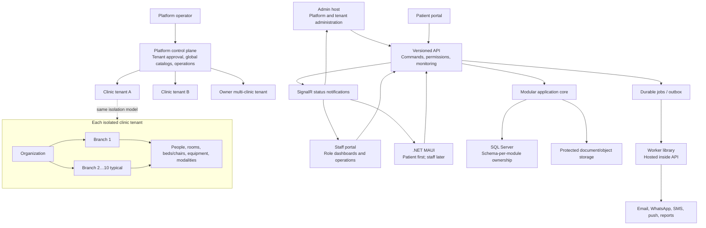
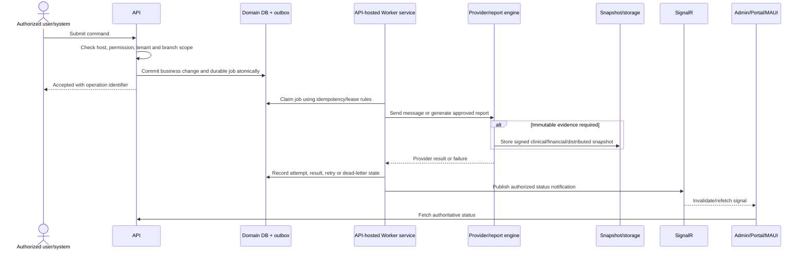

# 25 — Pre-development Architecture and Workflow Diagrams

Status: planning baseline  
Owner: product + architecture  
Last reviewed: 2026-08-09

## Purpose

Provide a compact visual companion to the detailed plans. These diagrams communicate approved direction; they are not a physical deployment specification, database schema, or authorization to begin implementation.

## 1. Multi-tenant product and host boundary

Key rules:

- Every tenant-scoped request must resolve and authorize the tenant and durable branch scope.
- Platform operators approve tenant activation and control the global document-type catalog.
- Authorized branch administrators self-manage allow-listed branch overrides; provider/legal verification may still gate domains and communication identities.
- SignalR announces authorized status changes. Clients refresh authoritative state through the API.

## 2. Clinic and branch onboarding approval

```mermaid
flowchart LR
    Start(["Onboarding starts"]) --> Route{"Who initiates?"}
    Route -->|"Clinic applicant"| Form["Clinic submits form and required documents"]
    Route -->|"Platform operator"| Direct["Operator enters registration directly"]
    Form --> Validate["Validate identity, ownership, contacts and documents"]
    Direct --> Validate
    Validate --> Review["Platform review and audit trail"]
    Review --> Decision{"Decision"}
    Decision -->|"Needs information"| Amend["Applicant/operator supplies correction"]
    Amend --> Review
    Decision -->|"Reject"| Rejected["Rejected with reason; no active access"]
    Decision -->|"Approve"| Provision["Provision tenant, owner access and first branch"]
    Provision --> Active["Tenant active"]

    Active --> Override["Authorized branch administrator edits allow-listed override"]
    Override --> ValidateOverride["Validate permission, scope, version and numbering rules"]
    ValidateOverride --> ProviderGate{"External verification required?"}
    ProviderGate -->|"No"| Apply["Activate versioned branch override and audit"]
    ProviderGate -->|"Yes"| Pending["Keep identity pending and unusable"]
    Pending --> Verified{"Provider/legal verification succeeds?"}
    Verified -->|"Yes"| Apply
    Verified -->|"No"| Keep["Keep inherited or previously verified identity"]
```

No applicant-submitted tenant becomes active without platform approval. Branch configuration is different: authorized branch administrators self-manage allow-listed overrides, while provider-gated identities remain unusable until externally verified. Direct clinic registration shortens data entry; it does not remove tenant-approval evidence.

## 3. Durable Worker, reporting and notification flow

Aspire AppHost starts API, Admin and Portal for development. In every environment the API hosts Worker-library handlers; multiple API instances coordinate through leases and idempotency. SignalR never replaces the durable job store.

## 4. Pre-development and implementation gates

```mermaid
flowchart LR
    P0["Planning baseline\nDocuments and working artifacts"] --> G0{"G0 Discovery"}
    G0 -->|"Live schema, anonymized evidence, rotated secrets"| G1{"G1 Foundation"}
    G1 -->|"Tenant isolation, authorization, audit, CI"| G2["Patient + resource scheduling"]
    G2 --> G3["Clinical workflows"]
    G3 --> G4["Billing and close"]
    G4 --> G4A["Queue + realtime"]
    G4A --> G4B["Worker + reporting"]
    G4B --> G5["Migration rehearsals"]
    G5 --> G6["Controlled clinic pilot"]
    G6 --> G7["Mobile + channels"]
    G7 --> G7A["Operational printing"]
    G7A --> Stable{"Clinic stability approved?"}
    Stable -->|"Yes + hospital requirements approved"| G8["Hospital expansion"]
    Stable -->|"No"| Improve["Measure, correct and repeat"]
    Improve --> Stable
```

Implementation does not begin merely because a plan exists. The applicable readiness gate in [document 22](22-implementation-readiness-checklist.md) must be approved, and the first build should be a separately authorized reference slice.

## Related artifacts

- [Pre-development artifact package](../outputs/bookdoc2026-predevelopment/README.md)
- [Product vision, scope and tenancy](12-product-vision-scope-and-tenancy.md)
- [Target architecture and new logic](03-target-architecture-and-new-logic.md)
- [Backend workers, reporting and printing](11-backend-workers-reporting-printing.md)
- [Pre-development decisions and questionnaire](23-pre-development-decisions-and-questionnaire.md)
