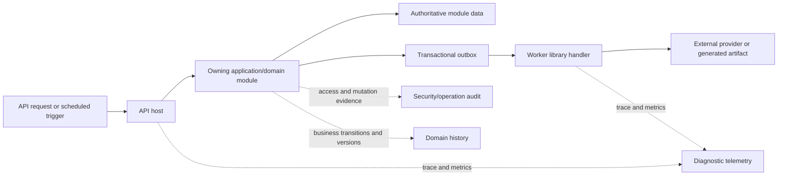

# 34 — Cross-Cutting Platform Hardening

Owner: Architecture + security + operations + module owners  
Status: Proposed architecture baseline  
Reviewed: 2026-08-18

## Purpose

Complete the target architecture with platform concerns that affect every clinic module but should not be copied into every project. This document adds implementation rules for observability, audit, configuration, feature rollout, API compatibility, resilience, storage, search, caching, localization, accessibility, software supply chain and business continuity.

These decisions strengthen the existing modular monolith. They do not introduce a microservice requirement, another production backend, a second business database or a generic `BookDoc2026.Platform` dependency.

## Architectural guardrails

1. Keep API, Admin and Portal as the three product applications. AppHost remains development orchestration and Worker remains an API-hosted class library.
2. A cross-cutting concern receives a shared library only when it has platform-neutral executable behavior and a stable dependency direction. Host middleware, UI presentation and persistence adapters remain with their host or Infrastructure.
3. Shared policy does not mean shared data access. Every operation still passes permission, tenant, organization, branch and record-scope checks at the owning module.
4. No library may become a service locator, unrestricted repository, global mutable state container or shortcut around module ownership.
5. Prefer measurable operational contracts over selected products. Redis, a search engine, a feature-flag service or a telemetry vendor is adopted only after a demonstrated need and an approved adapter decision.

## Capability ownership map

| Capability | Target owner | Shared rule | Explicit non-goal |
|---|---|---|---|
| Exception vocabulary and recovery hints | `BookDoc2026.ErrorHandling` | Stable safe codes/categories | HTTP/UI handling in the core library |
| Traces, metrics, health and standard log enrichment | `BookDoc2026.ServiceDefaults` plus host configuration | OpenTelemetry-compatible instrumentation and privacy controls | A separate observability library or vendor lock-in now |
| Security/operation audit persistence | Infrastructure adapter behind Application contracts | Append-only, tenant-scoped evidence | Using diagnostic logs as audit history |
| Domain history | Owning domain module | Version/transition history appropriate to the aggregate | A universal audit table replacing domain records |
| Runtime configuration | Owning module plus Infrastructure | Typed, validated, effective-scoped settings | One untyped global key/value table |
| Secrets and certificates | Deployment secret store; references in configuration | Rotation, least privilege and environment separation | Plaintext database/appsettings secrets |
| Feature flags and staged rollout | API composition and Infrastructure adapter | Scoped, audited, expiring flags | Treating a feature flag as authorization |
| API compatibility, limits and HTTP resilience | API and Client | Versioned contracts, bounded requests and safe retries | Domain depending on HTTP concepts |
| Durable outbound work | Worker/outbox | Idempotent claim, retry and dead-letter | SignalR or in-memory queues as durability |
| Durable inbound callbacks | Infrastructure inbox plus owning integration adapter | Signature/replay/idempotency verification | Direct provider callbacks mutating modules twice |
| File storage and scanning | Document metadata owner plus Infrastructure storage adapter | Quarantine, scan, checksum, retention and scoped access | Binary data in general entity tables |
| Reports and document generation | Reporting projections and `BookDoc2026.DocumentService` | Reproducible definitions and immutable issued snapshots | Report queries writing module tables |
| Search and cache | Module query/read-model layer plus Infrastructure adapter | Tenant-safe keys and bounded staleness | Cache/search index as system of record |
| Web presentation | Admin/Portal and `BookDoc2026.Blazor.UI` | Shared accessible states/components | Admin-only workflows leaking into Portal/mobile |
| Native presentation/device services | Mobile and `BookDoc2026.Maui.UI` | Secure storage, connectivity and native states | Mobile-specific behavior in Contracts/Domain |

## Observability, correlation and audit

BOOKDOC2026 uses three deliberately separate evidence types:

- **Diagnostic telemetry**: traces, metrics and redacted logs used to operate the system. It may be sampled and has an operational retention period.
- **Security/operation audit**: append-only evidence of access, mutations, approvals, exports, support elevation, configuration and sensitive document actions. It is not sampled.
- **Domain history**: business versions and transitions such as signed encounter amendments, appointment changes, invoice adjustments and resource status history. It is owned by the relevant module.



The three logical evidence destinations may initially share one SQL Server deployment or telemetry platform where appropriate, but their schemas, access, integrity and retention policies remain distinct.

Every request or job carries a trace ID. Durable work additionally carries operation ID, causation ID, correlation ID, tenant ID, job type and attempt; it never places patient names, phone numbers, clinical text, tokens or message bodies into telemetry. Incoming API correlation headers are accepted only after format/length validation; the server always controls its trace identity.

`BookDoc2026.ServiceDefaults` is the future composition point for OpenTelemetry-compatible traces, metrics, health checks and standard enrichment. Export destinations remain environment configuration. Minimum metric groups are API latency/error/rate, authentication failures, tenant throttling, database pool/query health, outbox age/retry/dead-letter, provider delivery, SignalR connections, report duration, storage/scanning backlog and cache effectiveness.

Each alert must name an owner, threshold, severity, runbook, tenant-impact method and recovery verification. Dashboards must show tenant-safe aggregates and prevent patient data from becoming metric labels.

## Configuration, secrets and feature rollout

Business configuration follows an explicit inheritance chain:

```text
platform default -> tenant -> organization -> branch
```

Only allow-listed settings may be overridden. Every effective value records source scope, version, effective dates, last modifier and approval/audit information where required. Clinical, financial, numbering, messaging and retention settings are strongly typed and validated before activation. Historical transactions retain the effective version or resolved value needed to explain their outcome.

Secrets, provider credentials, signing material and certificates are not ordinary business settings. Configuration stores a secret reference and non-sensitive metadata; the deployment secret store supplies the value. Rotation supports overlapping versions so access tokens, protected identifiers, callbacks and encrypted tenant credentials can transition without an unsafe all-at-once cutover.

Feature flags require owner, purpose, allowed scopes, default, start/expiry, rollout rule, rollback rule and audit. A flag may hide or progressively enable behavior, but it cannot grant permission, bypass tenant isolation, change an issued clinical/financial record or silently reinterpret historical data. Expired flags are removed rather than becoming permanent configuration debt.

## API, contract and client evolution

- Externally consumed HTTP contracts use an explicit major version. Breaking changes require a parallel compatibility window, migration guidance, usage evidence and an approved retirement date.
- Additive fields are preferred. Enum readers tolerate documented future values or map them safely; clients never branch on display text or exception messages.
- List endpoints use bounded pagination, allow-listed sorting/filtering and deterministic tie-breakers. Bulk operations define maximum items, payload size, partial-failure semantics and asynchronous execution thresholds.
- Commands that may be retried accept a tenant-bound idempotency key. The durable record stores a canonical request hash, status and result reference; reuse with a different payload is rejected.
- Mutable resources use optimistic concurrency (`ETag`/version or the protected contract equivalent) where lost updates matter.
- API rate limits are layered by trusted network, client, authenticated principal, tenant and expensive operation. Throttling cannot expose whether another tenant's record exists.
- The typed Client owns transport parsing, access-token lifecycle, safe retry eligibility and version negotiation. It never retries non-idempotent commands unless the command has a durable idempotency key.

## Resilience and integration delivery

All network calls have an explicit timeout and cancellation path. Retries apply only to classified transient failures, use bounded exponential backoff with jitter and respect provider retry guidance. Circuit breakers protect scarce threads/connections but do not replace durable retry. A timeout with an ambiguous external result enters reconciliation rather than automatically issuing a duplicate payment, message or clinical action.

Outbound durable effects use the transactional outbox and typed Worker handlers. Inbound provider callbacks use a durable inbox with provider/event identity, signature state, received timestamp, canonical payload checksum, tenant mapping, processing state and attempt history. Store raw payloads only when approved by classification/retention policy; otherwise retain the minimum evidence required for reconciliation.

Worker fairness prevents one busy tenant from starving others. Per-provider and per-tenant concurrency limits, leases, poison-message handling, manual replay permission and replay audit are required. SignalR communicates resulting status/invalidation only and is never an execution or reconciliation channel.

Application time is obtained through an injectable time abstraction (`TimeProvider` in .NET code). Tests control time for slot expiry, reminders, retention, key overlap, scheduled jobs and daylight-saving/time-zone cases.

## Data classification, storage and retention

Every stored field or document category is assigned one of: public, internal, confidential, personal, sensitive health, financial or secret. Classification determines masking, encryption, export, telemetry, retention, backup and support-access behavior.

Uploaded content follows `Requested -> Quarantined -> Scanned -> Active` or `Rejected` states. Validation covers declared/actual type, extension, size, checksum, malware result and decompression limits. Active files use opaque storage keys and short-lived authorized access; original filenames are display metadata, never storage paths. Download responses use safe content disposition and prevent active-content execution where possible.

The database stores document identity, owner, classification, version, checksum, storage reference, scan evidence and retention/legal-hold state. `BookDoc2026.DocumentService` continues to generate artifacts but does not become an unrestricted storage repository. Signed clinical documents, prescriptions, invoices, receipts and officially distributed reports retain immutable content hashes and snapshots as already decided.

Deletion is an authorized lifecycle, not a direct blob removal. It checks legal hold, clinical/financial retention and replicas/backups, then records tombstone/deletion evidence. Backup encryption, restore permissions and key recovery are tested together.

## Query projections, search and caching

Start with indexed SQL Server queries and module-owned projections. Introduce a distributed cache or separate search engine only after measurements show that indexed queries/projections cannot meet an approved service objective.

Cache keys always include tenant and every scope that changes the result, plus contract/projection version. Cache entries contain no authorization decision that can outlive a grant change; revocation-sensitive results use short lifetime or explicit invalidation. Cache failure degrades to an authorized source query and never to cross-tenant or stale clinical/financial writes.

Search indexes are derived, rebuildable and never authoritative. Index documents contain the minimum searchable data, apply the same tenant/branch/record filters before result return and support deletion/retention propagation. Patient matching and duplicate resolution remain explicit Patient/Stakeholder workflows rather than fuzzy-search side effects.

Dashboards and operational reports declare their `as-of` time and freshness. Financial closing, occupancy allocation and signed clinical output query authoritative state or an explicitly reconciled snapshot, not an eventually consistent cache.

## Localization, accessibility and human factors

- Persist canonical codes/values; localize labels at presentation and template-rendering boundaries.
- Use `en-IN` as the initial presentation default while allowing approved user/tenant cultures. Hindi and other languages are added only with reviewed clinical and operational translations.
- Store money as currency plus decimal amount; the initial commercial default is INR, never an implicit global currency.
- Store instants in UTC and the applicable branch/source time-zone identifier. Render dates, numbers and schedules using the user's authorized branch context and culture.
- Version message, consent, clinical instruction and document templates by culture. Missing safety-critical translations fail to an approved fallback, never an unreviewed machine translation.
- Web experiences target WCAG 2.2 AA as the product accessibility baseline: keyboard use, visible focus, semantic labels, contrast, zoom/reflow, reduced motion, error association and non-color status cues.
- Mobile additionally handles screen readers, dynamic type, touch targets, connectivity changes and safe reauthentication. Offline views clearly display freshness and prohibit unsupported clinical/financial writes.

## Platform control plane and support access

Platform operations need explicit control-plane capabilities inside authorized Admin routes: clinic application/approval, tenant lifecycle, quota/plan assignment, provider verification status, configuration policy, feature rollout, job/dead-letter health, security events and aggregate service health.

Platform authority does not imply clinic data access. Support elevation requires a ticket/reason, named tenant and scopes, approval where configured, short expiry, reauthentication, visible session marking and immutable start/action/end audit. Export, clinical access and financial adjustment remain separate permissions. Emergency access policy must define notification and retrospective review before production.

Tenant suspension, closure and export are state machines. Suspension must not accidentally destroy legal access to existing clinical records; closure coordinates contract, export, retention, legal hold, identity revocation, provider shutdown and eventual deletion.

## Software supply chain and release safety

Before pilot, the build pipeline should add central package-version governance, reproducible restore, dependency/vulnerability review, secret scanning, static analysis, test result retention, an SBOM and signed immutable release artifacts. Package updates are reviewed and promoted through integration/staging; production never restores floating versions during deployment.

Database delivery uses expand/migrate/contract changes where compatibility is required. Destructive migrations need volume/lock analysis, backup/restore prerequisites, reconciliation and explicit approval. Application and migration artifacts are version-paired, and only one controlled migration actor runs against an environment.

Release flags separate deployment from activation. A release records configuration/schema/template/report versions, provider adapter versions, known risks, rollback or forward-fix criteria and the exact evidence already required by the operational plan.

## Availability, disaster recovery and downtime behavior

Set RPO, RTO and availability targets by capability rather than one unrealistic system-wide number. Identity, current scheduling/queue, clinical record, billing/payment, messaging, reports and historical documents have different urgency and acceptable loss.

For each critical workflow define behavior when database, storage, identity, provider, internet, SignalR or printer is unavailable. Safe degradation examples include read-only cached shell metadata, delayed messages, browser/PDF fallback and manual queue procedures. The system must never pretend an appointment, payment, prescription or clinical signature succeeded when durable confirmation is absent.

Restores are proven in an isolated environment with integrity, tenant-isolation, document checksum, Identity, outbox/inbox and report reconciliation tests. Disaster-recovery exercises include key/secret availability and vendor dependencies, not only database restoration. Clinic-facing downtime and recovery procedures are versioned, trained and included in pilot evidence.

## Testing and evidence additions

Every applicable vertical slice adds:

1. tenant/branch/record authorization and identifier-tampering tests;
2. deterministic time, concurrency and idempotency tests;
3. contract compatibility and bounded-input tests;
4. telemetry redaction and audit completeness tests;
5. retry, timeout, ambiguous-result, inbox/outbox and replay tests;
6. configuration inheritance, secret absence and feature rollback tests;
7. file type/size/malware/quarantine/access/retention tests when documents are involved;
8. cache/search invalidation and cross-tenant tests when those facilities are introduced;
9. accessibility checks plus keyboard/screen-reader-oriented manual evidence for release journeys;
10. backup/restore, degraded-mode and operational runbook evidence at the relevant phase gate.

Synthetic test data must include multiple tenants, identical identifiers/names across tenants, large-owner-tenant load, clock boundaries, branch overrides, revoked grants and hostile inputs. No production patient data is permitted in lower environments or automated test artifacts.

## Project creation decisions

Do not create new projects merely to mirror every heading in this document. The current preferred placement is:

- extend `BookDoc2026.ServiceDefaults` for host-standard telemetry/health/resilience registration;
- keep API middleware, versioning, rate limits and HTTP policy in `BookDoc2026.Api`;
- keep provider/persistence/storage/cache/search implementations in `BookDoc2026.Infrastructure` behind Application or specialized library interfaces;
- keep durable orchestration in `BookDoc2026.Worker` and channel logic in `BookDoc2026.Messaging`;
- keep generated-file logic in `BookDoc2026.DocumentService` and template resolution in `BookDoc2026.Templates`;
- keep platform-neutral errors in `BookDoc2026.ErrorHandling` and host-specific visual handling in the UI projects.

A future dedicated library is justified only when at least two consumers need the same stable behavior, its dependencies remain one-directional, ownership and tests are clear, and placing it in an existing project would violate that project's purpose. Likely candidates to evaluate later are reporting execution contracts and storage abstractions; neither is authorized until its first vertical slice defines the real interface.

## Recommended implementation sequence

1. Add trace/correlation standards, redaction tests, audit contract and injectable time to the next durable messaging slice.
2. Add typed configuration hierarchy and feature-flag records when the first branch override is implemented.
3. Add durable inbox/reconciliation with the first real messaging or payment provider callback.
4. Add storage quarantine/scanning with the first approved patient/tenant document upload.
5. Add API compatibility, paging/limit and idempotency conventions before expanding public endpoints.
6. Establish CI supply-chain evidence and restore rehearsal before the controlled clinic pilot.
7. Introduce distributed cache/search only after production-like measurements demonstrate need.

## Acceptance gate

This architecture improvement is ready to guide implementation when:

- owners approve the capability map and no dependency contradicts DOC-003 or DOC-032;
- privacy/security approve the evidence separation, classification and redaction rules;
- operations approve correlation, SLO/alert ownership, restore and degraded-mode evidence;
- API/client owners approve compatibility, pagination, concurrency and retry rules;
- the first affected slice links its requirements, permissions, schema, tests, telemetry and runbook to these rules;
- any proposed new project passes the project-creation criteria above.
