# 35 — Path to 100% Architecture and Clinic-MVP Achievement

Owner: Product + architecture + delivery + security + operations + module owners  
Status: Proposed execution control plan  
Reviewed: 2026-08-18  
Baseline: 62% simple average across the twenty concerns in DOC-033 after the Admin security foundation reference slice

## Purpose

Provide an evidence-based execution path from the current 62% architecture-achievement checkpoint to 100% for the agreed BOOKDOC2026 clinic-management scope. This plan converts every row in the [Architecture Understanding and Achievement Report](33-architecture-understanding-and-achievement-report.md) into implementation, validation and acceptance gates.

This document does not claim that planning raises the score. It defines how later work earns each increase.

## What 100% means

`100%` means all twenty DOC-033 concerns satisfy their currently agreed clinic-scope acceptance evidence, no required clinic-MVP work remains open, the migration/pilot is accepted, and production operations can support the release safely.

It does **not** mean:

- every future hospital module is implemented;
- employee/payroll is implemented before its database and rules are supplied;
- every possible integration, specialty or report has been built;
- architectural documents alone are complete product evidence;
- the system can never receive another enhancement.

Future hospital, payroll and optional integrations remain separately gated. Their approved deferral does not prevent the clinic scope reaching 100%, provided no hospital-only behavior is represented as clinic completion.

## Scoring method

The report remains a simple average of twenty row scores. A score changes only during an evidence review and must link to working artifacts, tests and acceptance.

| Score | Evidence meaning |
|---:|---|
| 0% | Idea only; no approved outcome or evidence |
| 25% | Boundary and intended outcome documented; major decisions or ownership remain open |
| 50% | Implemented reference foundation proves the main technical direction but not an end-to-end user outcome |
| 75% | Main clinic behavior works end to end with authorization, persistence and automated tests; production/edge evidence remains |
| 90% | Release-candidate behavior passes security, migration, operational and user-acceptance rehearsal; only named closure items remain |
| 100% | Agreed clinic scope is implemented, accepted, operationally supported and has no unresolved mandatory evidence |

Rules:

1. A row cannot reach 75% from documentation or project scaffolding alone.
2. A row cannot reach 90% without negative authorization, tenant-isolation, failure-path and operational evidence appropriate to it.
3. A row cannot reach 100% while a mandatory acceptance item in this plan is deferred without approved scope removal.
4. Passing unit tests alone does not prove a user journey, production security or migration readiness.
5. Scores are not engineering-hour percentages and must not be used for earned-value billing.
6. If later evidence invalidates a decision or test, the score may decrease.

## Scope and evidence flow

```mermaid
flowchart LR
    D["Live evidence and owner decisions"] --> F["Hardened reference foundation"]
    F --> O["Tenant, Party and operational workflows"]
    O --> C["Clinical, contract and billing completion"]
    C --> X["Channels, reports, documents and mobile"]
    X --> M["Migration and production rehearsal"]
    M --> P["Controlled clinic pilot"]
    P --> A["Twenty-row acceptance audit: 100%"]
```

Work may run in parallel when dependency and data ownership allow it, but no later gate may hide an unmet earlier safety or migration dependency.

## Twenty-point completion contract

| # | Baseline | Required evidence for 100% | Primary work/owner | Main dependency |
|---:|---:|---|---|---|
| 1 | 90% | Architecture/legacy authority ADR accepted; live DB and user walkthrough traceability complete; forbidden dependency and legacy-copy checks remain green | Architecture + discovery | Production evidence and workflow owners |
| 2 | 100% | Preserve the three-product-host boundary through architecture tests and release review; any new executable host requires an approved ADR | Architecture | Continuous regression control |
| 3 | 90% | API composes all clinic modules, commands, queries, provider adapters and Worker services with versioned contracts, authorization, observability, limits and runbooks | Backend + module owners | Rows 11–19 |
| 4 | 85% | Typed immediate/scheduled handlers, fair leasing, retry/dead-letter/replay, monitoring and idempotency pass multi-instance tests; legacy Windows service completes controlled parallel run and retirement | Worker + operations | Message/task inventory and providers |
| 5 | 95% | AppHost launches the complete development topology and selected dependencies with documented profiles, synthetic seed procedure and smoke evidence; remains absent from production | Developer experience | Selected SQL/storage/telemetry development dependencies |
| 6 | 55% | Admin implements authorized control plane, tenant/configuration/user management, reports/schedules, import/export, audit/jobs and fail-closed network restriction with accessible UX | Admin + platform + security | Rows 3, 11, 12, 18 |
| 7 | 40% | Portal implements secure session UX, permission dashboards and approved clinic/patient workflows with scoped data, visible error/recovery states and accessibility evidence | Portal + product | Stable APIs and rows 9–10 |
| 8 | 50% | Approved MAUI M1 journeys work on supported real devices with secure session rotation, push/deep links, connectivity/offline rules, accessibility and release operations | Mobile + product | Rows 7, 9, 10, 17 |
| 9 | 40% | Shared design tokens, layouts, authorization-aware navigation and loading/empty/error/offline states are reused by real Admin/Portal/Mobile journeys and pass component/accessibility tests | Blazor.UI + Maui.UI + UX | Approved screen system |
| 10 | 75% | One versioned Contracts/Client boundary supports every shipped host; login/refresh/revoke/replay, compatibility, typed errors and device token storage pass integration/device tests | Client + Identity + mobile | Rows 3 and 11 |
| 11 | 85% | MFA/privileged policy, production signing-key and Data Protection operations, session/device administration, access reviews and revocation are implemented and rehearsed | Identity + security + operations | Production environment and policy approval |
| 12 | 75% | Onboarding/control-plane UX, approval/provisioning, lifecycle, quotas, branch overrides, support elevation, export/closure and large-tenant fairness/isolation pass acceptance | Platform + tenant module | Named platform operators and scale tests |
| 13 | 70% | Stakeholder/Patient duplicate detection and merge, consent, relations, document lifecycle and representative production migration maps work without duplicating party data | Stakeholder + Patient Registry | Live schema/profile and clinic owner decisions |
| 14 | 55% | Confirmed multi-resource booking covers practitioners, rooms, equipment/modalities and approved bed/chair categories, including reschedule/cancel/waitlist/overbook/concurrency rules | Catalog + Resources + Scheduling | Approved resource/rule catalog |
| 15 | 15% | Legacy contract/package entitlement matrix is user-approved; contract consumption, price/tax snapshots, invoice/payment/allocation/refund/adjustment/daily-close flows reconcile end to end | Contract + Billing + finance owners | Live legacy data and business owner workshops |
| 16 | 15% | Permission-composed dashboards and first OPD plus imaging queue vertical slice work in approved hosts; scoped SignalR reconnect/invalidation and API reconciliation pass | Dashboard + Queue + Realtime | Rows 6–7, 14 and clinical workflows |
| 17 | 65% | Published database templates, consent/preferences, provider adapters, signed callbacks/inbox, typed Worker delivery, retries/dead letters and status reconciliation work for approved channels | Messaging + Templates + Worker | Vendor approvals and row 4 |
| 18 | 25% | All 45 primary layouts and 43 export variants are classified; accepted reports pass permissions/golden results and HTML/PDF/XLSX/CSV output; schedules/snapshots/retention pass; browser printing works and local-agent scope is either accepted or formally deferred | Reporting + DocumentService + Admin/Portal | Stable projections, owners and legacy samples |
| 19 | 45% | Live database profile and signed mappings exist; repeatable staged ETL passes at least two rehearsals, count/money/relationship/workflow reconciliation, performance and rollback/cutover evidence | Data migration + module owners | Read-only schema and anonymized representative data |
| 20 | 70% | CI covers unit/integration/architecture/contract/UI/security/load/device/migration checks as applicable; observability, audit, SBOM, backup/restore, DR, UAT, pilot and release evidence are accepted | QA + security + operations + product | All rows |

Row 2 is already at 100% and is maintained rather than reimplemented. Every other row has an explicit closure contract above.

## Execution workstreams

### WS0 — Decisions, live evidence and traceability

Outcome: replace remaining assumptions with approved evidence.

- close blocking items in DOC-023 and specialty decisions in DOC-024;
- name product, clinical, finance, reporting, privacy, security and operations acceptance owners;
- obtain read-only production schema plus representative anonymized data;
- complete legacy desktop/Xamarin/service/report runtime walkthroughs;
- approve terminology, permission/scope, lifecycle and contract/package rule matrices;
- build requirement-to-workflow-to-contract-to-schema-to-test traceability.

Exit: G0 discovery evidence accepted and no next-slice owner or safety rule is unknown.

### WS1 — Production-grade platform foundation

Outcome: make the existing reference foundation safe for expansion.

- implement privacy-safe tracing/correlation, audit separation and deterministic time;
- implement typed configuration inheritance, managed secret references and feature rollout controls as first required;
- finish API versioning, paging/limits, concurrency and idempotency conventions;
- complete Identity privileged-access, signing-key/session and support-elevation controls;
- establish CI supply-chain, migration and restore evidence;
- extend architecture tests so new modules cannot bypass boundaries.

Exit: G1 and G1A pass through one reference vertical slice in API, Client and at least one UI host.

### WS2 — Tenant control plane and frontend systems

Outcome: activate and operate tenants safely through usable hosts.

- Admin: network restriction, platform onboarding/approval, tenant lifecycle, users/roles/scopes, branch configuration, audit and job health;
- Portal: authentication/session shell, scoped navigation, permission dashboards and standard result/error states;
- shared Blazor/MAUI design system: tokens, layouts, forms, grids, loading/empty/error/offline/forbidden states and accessibility;
- AppHost: documented complete local topology with synthetic data only.

Exit: a platform operator can approve a synthetic clinic and its authorized owner can configure a branch without gaining clinical cross-tenant access.

### WS3 — Party, patient, catalog, contract and scheduling completion

Outcome: deliver the complete non-clinical foundation for daily clinic operations.

- finish Stakeholder/Patient duplicate, merge, consent, representative and document workflows;
- approve services, capabilities and generalized resource/bed-chair categories;
- implement contract/package eligibility, limits, visit consumption and reversal rules before confirmed booking relies on them;
- implement multi-resource booking, reschedule, cancel, waitlist, check-in and conflict handling;
- prove concurrency at normal and large-owner-tenant load.

Exit: G2 passes with accepted contract entitlement and generalized resource booking, not doctor-only booking.

### WS4 — Clinical, queue and revenue completion

Outcome: complete a safe visit from arrival through care and settlement.

- implement Queue tickets/stages and permission dashboards with SignalR invalidation;
- implement Encounter draft/sign/amend, Physiotherapy and Orthopaedic approved content, prescriptions and investigations;
- complete first imaging worklist/queue slice, recommended X-ray or CT;
- implement price/tax snapshots, invoice, collection/allocation, discount approval, refund/adjustment and daily close;
- generate and retain required immutable clinical/financial artifacts.

Exit: G3, G4 and G4A pass with clinical sign/amend and money reconciliation evidence.

### WS5 — Durable communications, reporting, documents and printing

Outcome: replace legacy operational side systems with owned platform behavior.

- connect published Templates -> Messaging -> outbox -> Worker -> sandbox provider -> callback inbox -> delivery status;
- add email, WhatsApp, approved SMS fallback and push adapters only after vendor gates;
- implement report catalog, permissions, projections, schedules, snapshots and exports;
- classify 45 primary reports and 43 export variants, then validate the accepted active set with golden results;
- implement browser/PDF printing; build the local agent only if hardware evidence approves the constrained need;
- parallel-run and retire the Windows service/WinForms reporting paths only after their gates pass.

Exit: G4B and the relevant Worker/report/printing gates pass with owner-approved retirement evidence.

### WS6 — Portal/Mobile journeys and integration hardening

Outcome: deliver approved workflows consistently across web and mobile.

- finish role-scoped Portal operational and patient self-service journeys;
- deliver MAUI M1 authentication, booking, appointments, notifications and documents;
- verify Android/iOS/Windows support policy, secure storage, push, deep links, accessibility and connectivity behavior on real devices;
- validate provider timeouts, retry, rate limits, replay, ambiguity and reconciliation;
- add staff mobile M2/M3 only when explicitly included in the clinic-completion release.

Exit: G7 passes for the approved mobile/channel release scope.

### WS7 — Migration, operational rehearsal and controlled pilot

Outcome: prove that the product can safely replace the legacy system.

- build repeatable extraction, transform, quarantine, load and reconciliation tooling;
- run at least two complete migration rehearsals using production-shaped anonymized data;
- test performance/noisy-neighbour behavior for normal tenants and the large owner-operated tenant;
- pass penetration/security/privacy/accessibility review, backup/restore, disaster recovery and incident exercises;
- train users, execute controlled parallel/cutover, reconcile daily and prove rollback/forward-fix readiness;
- record UAT, operations and product go/no-go decisions.

Exit: G5 and G6 pass; mandatory pilot issues are closed or removed from scope through approved change control.

### WS8 — Final 100% evidence audit

Outcome: close the report without optimistic scoring.

For every DOC-033 row:

1. link implemented source, migrations and configuration ownership;
2. link automated and manual evidence;
3. link permission, isolation, privacy and failure-path results;
4. link business/UAT and operations acceptance;
5. confirm no mandatory work remains for the agreed clinic scope;
6. assign 100% only after independent review by the named owners.

Exit: all twenty rows are 100%, the arithmetic is verified, and the report clearly records excluded future scope.

## Gate sequence

| Stage | Required gates | Principal rows advanced | Cannot pass while |
|---|---|---|---|
| A — Evidence ready | G0 | 1, 13, 15, 18, 19 | live schema, owners or critical rules are missing |
| B — Foundation hardened | G1 + G1A | 2–5, 10–12, 20 | isolation, Identity, audit, correlation or restore baseline fails |
| C — Clinic operations | G2 | 6–7, 12–15 | contract eligibility or multi-resource conflicts are unresolved |
| D — Care and revenue | G3 + G4 + G4A | 14–16, 20 | signing/amendment, queue or money reconciliation fails |
| E — Side systems replaced | G4B + Worker/report/printing gates | 4, 17–18 | legacy parallel/golden results or provider reconciliation fails |
| F — Migration/mobile ready | G5 + G7 | 8–10, 17, 19–20 | device, migration or channel evidence is incomplete |
| G — Controlled pilot | G6 | all incomplete rows | rollback, support, security/privacy or UAT has a mandatory open issue |
| H — Final audit | G7B + DOC-035 WS8 | all rows to 100% | any row lacks implementation plus acceptance evidence |

## First twelve six-hour planning and implementation sessions

These sessions start the critical path without mass-generating modules:

| Session | Six-hour outcome | Evidence produced |
|---:|---|---|
| 1 | Approve DOC-035 scoring, clinic completion scope and named acceptance roles | Signed decisions/change log |
| 2 | Close the highest-risk unanswered DOC-023 capacity/legal/ownership inputs | Updated decision register |
| 3 | Prepare and review the live database read-only profile/anonymization runbook | Approved extraction/profile procedure |
| 4 | Define correlation, audit-vs-telemetry and redaction contracts for the durable messaging slice | Contract + threat cases + test list |
| 5 | Add deterministic time and durable message idempotency acceptance design | Slice specification and failure matrix |
| 6 | Specify published template, consent/preference and branch-override lifecycle | State machine and permissions |
| 7 | Specify outbound message, provider attempt and callback-inbox persistence | Reviewed schema/migration plan |
| 8 | Implement/test the smallest Template -> outbox -> Worker -> fake provider path | Unit/integration/isolation evidence |
| 9 | Implement/test callback inbox, replay rejection and delivery reconciliation | Failure/retry/replay evidence |
| 10 | Expose authorized delivery status through Client and one Admin/Portal screen | End-to-end host evidence |
| 11 | Add telemetry redaction, dead-letter visibility and operational runbook | Observability/runbook evidence |
| 12 | Review the slice against G1/G1A, update scores only where earned and recalibrate remaining work | Gate report and updated ROM assumptions |

Sessions requiring live data or business approval pause only their dependent track. Independent security, test, UI-system and durable-message work can continue with synthetic data and fake providers.

### Execution checkpoint — 2026-08-18

[DOC-036](36-durable-messaging-reference-slice.md) completes the durable outbound reference, [DOC-037](37-admin-communication-management-reference-slice.md) adds template management and delivery monitoring, [DOC-038](38-communication-preferences-and-callback-inbox-reference-slice.md) adds stakeholder preference evidence plus signed fake-provider callback deduplication/reconciliation, and [DOC-039](39-admin-security-foundation-reference-slice.md) adds server-side Admin session rotation/revoke, permission-aware navigation and fail-closed network/trusted-proxy policy. Real providers, consent enforcement in a patient-addressed handler, production privileged-session/MFA policy, raw callback quarantine decisions and operational runbooks remain open, so those sessions are not treated as fully complete.

## Effort and schedule control

The authoritative expanded clinic web/backend/reporting/printing ROM remains **3,310–5,445 engineering hours before the 25–40% uncertainty reserve**. Patient MAUI M1 adds **180–280 hours** and staff MAUI M2/M3 adds **340–560 hours** when included. Employee/payroll remains excluded.

Do not calculate remaining effort as `38%` of that ROM. The achievement score measures evidence maturity, and the least mature rows—billing, queues, reporting and migration—contain disproportionately large work. Record actual accepted work against DOC-006 epics, then re-estimate:

1. after live database/profile and business-rule approval;
2. after the first production-grade durable vertical slice;
3. after contract/booking/billing scope approval;
4. after report classification and provider/hardware decisions;
5. before migration rehearsal and pilot commitment.

No new DOC-035 estimate is added on top of DOC-006. Cross-cutting hardening is already distributed across foundation, security/platform, integration and pilot-hardening epics.

## Score review and reporting cadence

- Per completed vertical slice: update only affected row evidence; do not round up for work in progress.
- Every two weeks during active implementation: review blockers, dependencies, test evidence and score proposals.
- At every phase gate: product, architecture, QA/security and operations approve their applicable evidence.
- Before pilot: freeze the clinic scope and list every explicitly excluded future item.
- After pilot stabilization: run WS8 and publish the final twenty-row evidence table.

Every score change records old score, new score, evidence links, reviewers, date, remaining work and any scope change. The master navigator and DOC-008 register remain the authoritative document controls.

## Principal risks and controls

| Risk | Control |
|---|---|
| Planning appears complete while workflows are untested | 75% requires a working end-to-end user outcome |
| Score is mistaken for elapsed effort | Keep score and engineering-hour ledger separate |
| Live legacy rules arrive late | Prioritize WS0 and build explicit rule matrices before Billing/Contract completion |
| Large owner tenant dominates shared resources | Tenant-aware load tests, quotas and Worker fairness |
| Provider selection blocks development | Use contract-tested fake/sandbox adapters; production score waits for approved provider evidence |
| Reports expand without control | Classify 45 primary/43 variants before reconstruction |
| Shared libraries become dependency shortcuts | Enforce DOC-034 project-creation and architecture-test rules |
| Migration is left until the end | Rehearse after every completed data-owning module and run two full rehearsals |
| Optional hospital scope prevents clinic closure | Freeze clinic acceptance scope; hospital modules remain under G8 |
| 100% is declared with operational gaps | WS8 requires business, security, QA and operations acceptance for every applicable row |

## Final completion checklist

The report may state 100% only when all are true:

- all twenty completion contracts have linked evidence and 100% owner approval;
- every clinic-MVP requirement is accepted or formally removed through change control;
- no critical/high unresolved security, privacy, clinical-safety, money-reconciliation or tenant-isolation defect remains;
- migrations and rollback/forward-fix are rehearsed and accepted;
- Worker, reports and legacy retirement gates pass;
- approved Admin, Portal and MAUI journeys pass UAT and accessibility evidence;
- production observability, support, backup/restore, incident and disaster-recovery evidence is current;
- the controlled pilot has completed its stabilization period and reconciliation;
- hospital and employee/payroll exclusions are clearly recorded;
- DOC-033 arithmetic, links, dates and evidence are independently verified.
