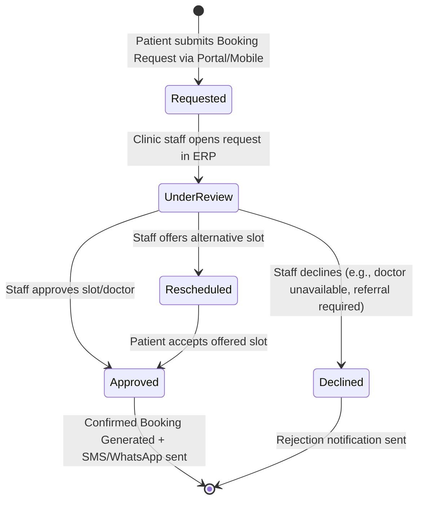

# 60. Dual Front-End Architecture: Clinic ERP vs. Public Portal & Doctor Slot / Booking Request Specification

- **Document Version**: 1.1.0
- **Status**: Implemented & Verified
- **Date**: 2026-09-27
- **Author**: Antigravity & Architecture Team

---

## 1. Executive Summary & Core Principle

In accordance with architectural standards and clinic operational requirements:
1. **Dual Front-End Topology**:
   - **ERP (`BookDoc2026.Admin`)**: Internal clinic/hospital intranet only. Heavy, authoritative system for clinic staff, doctors, roster management, slot generation, reception, billing, and approval oversight.
   - **Portal (`BookDoc2026.Portal` & `BookDoc2026.Mobile`)**: Worldwide, lightweight, responsive client for patients and external stakeholders.

2. **The Booking Duality (Pre-Approved Slots vs. Booking Requests)**:
   - **ERP Pre-Approved Slots**: The clinic sets up doctor working shifts and uses the **Slot Generator** to publish open consultation slots. Because the clinic explicitly defined and opened these slots, any patient booking made against an open slot is **instantly confirmed without requiring manual clinic approval**.
   - **Portal Booking Requests**: When a patient requests an appointment outside published slots, requests a specific non-scheduled consultation, or requests when open slots are full, it creates a **Booking Request (`PendingApproval`)**. This lands in the ERP **Approval Queue**, where clinic reception/administrative staff reviews, triages, assigns, and approves or reschedules it.

---

## 2. System Topology & Boundary Separation

```mermaid
flowchart TD
    subgraph Public["Public & Patient Domain (Worldwide / Lightweight)"]
        Portal["BookDoc2026.Portal (Blazor WebAssembly)"]
        Mobile["BookDoc2026.Mobile (MAUI Android / iOS)"]
    end

    subgraph Internal["Clinic / Hospital Intranet (Protected / ERP)"]
        ERP["BookDoc2026.Admin (Blazor Server ERP)"]
        Workstation["Reception / Cashier / Doctor Workstations"]
    end

    subgraph Core["Backend API & Modular Monolith"]
        Gateway["BookDoc2026.Api (ASP.NET Core REST API)"]
        SlotEngine["Slot & Availability Engine"]
        ApprovalEngine["Booking Request & Approval Workflow"]
        Db[("PostgreSQL / SQLite Database")]
    end

    Portal -->|1. Book Pre-Approved Slot (Instant)| Gateway
    Portal -->|2. Submit Booking Request (Pending Approval)| Gateway
    Mobile -->|1. Book Pre-Approved Slot (Instant)| Gateway
    Mobile -->|2. Submit Booking Request (Pending Approval)| Gateway

    ERP -->|Generate & Manage Doctor Slots| Gateway
    ERP -->|Review & Approve Booking Requests| Gateway
    Workstation --> ERP

    Gateway --> SlotEngine
    Gateway --> ApprovalEngine
    SlotEngine --> Db
    ApprovalEngine --> Db
```

---

## 3. Doctor Slot Generator (ERP Module)

### 3.1 Background & Legacy Gap
In the legacy system (`BookDocAppointment`), slot generation was rudimentary and lacked batch doctor roster planning, granular duration settings, and recurrence. In `BOOKDOC2026-GA`, the internal ERP provides a dedicated **Doctor Roster & Slot Generator**.

### 3.2 Domain Model (`BookingSlot`)
- `BranchId` (Tenant-scoped)
- `PractitionerId` (Attending Doctor)
- `ServiceId` (e.g. OPD General Consultation, Follow-up, Specialty)
- `SlotDate` (DateOnly)
- `StartTimeUtc` & `EndTimeUtc` (DateTimeOffset)
- `SlotDurationMinutes` (e.g., 10, 15, 20, 30 minutes)
- `MaxCapacity` (default 1 patient, or multiple for group/therapy sessions)
- `BookedCount` (number of confirmed bookings)
- `Status`:
  - `Available` (open for booking in Portal/Mobile without approval)
  - `PartiallyBooked` (for capacity > 1)
  - `FullyBooked`
  - `Blocked` (e.g. Doctor emergency leave / surgery block)
  - `Cancelled`

### 3.3 Slot Generation Parameters in ERP
Staff or doctors configure:
1. **Practitioner & Branch**: Select Dr. John Doe at Central Clinic.
2. **Date Range**: e.g., 01-Oct-2026 to 07-Oct-2026.
3. **Weekly Pattern**: Monday through Saturday.
4. **Shift Timings**:
   - Morning Shift: 09:00 AM - 01:00 PM (15-min slots $\to$ 16 slots)
   - Evening Shift: 05:00 PM - 08:00 PM (15-min slots $\to$ 12 slots)
5. **Break Times**: e.g. 11:30 AM - 11:45 AM tea break (auto-excluded).
6. **Action**: "Generate & Publish Pre-Approved Slots".

---

## 4. Booking Request & Approval Lifecycle (Portal $\to$ ERP)

### 4.1 State Machine



### 4.2 Two Distinct Booking Journeys

| Aspect | Pre-Approved Slot Booking | Booking Request Workflow |
| :--- | :--- | :--- |
| **Origin** | Patient Portal / Mobile App | Patient Portal / Mobile App |
| **Trigger** | Patient picks a green available slot created by ERP | Patient requests time window or doctor with no free slots |
| **Approval** | **None Required** (Pre-approved by ERP slot generator) | **Requires Clinic Approval** in ERP Approval Queue |
| **Immediate State** | `Confirmed` (Booking ID + Token issued) | `PendingApproval` (Request Token issued) |
| **Next Step** | Patient arrives at clinic or joins teleconsult | ERP Receptionist reviews, assigns doctor/slot, and clicks "Approve" |
| **Post-Approval** | Immediate confirmation receipt | Patient notified via SMS/WhatsApp with confirmed appointment time |

---

## 5. Screen Inventory & Front-End Allocation

### 5.1 ERP Internal Front-End (`BookDoc2026.Admin`)
1. **Doctor Roster & Slot Generator (`/scheduling/slots`)**:
   - Shift planning, slot interval setting, batch slot publisher.
2. **Booking Requests Approval Queue (`/scheduling/booking-requests`)**:
   - Worklist of pending requests with patient name, contact, preferred time, reason.
   - 1-click Approve, Reschedule, or Decline dialog.
3. **Clinic Reception Desk (`/reception`)**:
   - Walk-in token issuance, family member linking, package validation.
4. **Cashier & Billing Desk (`/billing/cashier`)**:
   - Invoice issuance, payments, package entitlement linking/unlinking.
5. **Clinical Encounters & EMR (`/clinical/encounters`)**:
   - Doctor consultation notes, Senior doctor supervision, Rx prescription writer.

### 5.2 Lightweight Public Portal (`BookDoc2026.Portal` & Mobile)
1. **Public Doctor Directory & Slot Booking (`/book-appointment`)**:
   - Choose Doctor $\to$ Choose Date $\to$ Click available open slot $\to$ Instant booking confirmation.
2. **Request an Appointment (`/request-appointment`)**:
   - For custom timing/consultations: Enter Patient details + preferred date range + reason $\to$ Submit Booking Request.
   - Status tracker: View status of request (Pending, Approved, Confirmed).
3. **Patient Active Packages & Family Members (`/my-packages`, `/my-family`)**:
   - View remaining visits on active packages.
   - Manage linked family members under the primary phone number.

---

## 6. Implementation Status & Verification
 
- [x] **Phase 1: Domain & Contracts for Slots & Booking Requests (Completed)**:
   - Added `BookingSlot` entity (`ReserveCapacity`, `ReleaseCapacity`, `Block`, `Unblock`, `Cancel`) with tenant scoping in `BookDoc2026.Domain.Scheduling`.
   - Added `BookingRequest` entity with lifecycle methods (`Submit`, `MarkUnderReview`, `Approve`, `Decline`, `Reschedule`) in `BookDoc2026.Domain.Scheduling`.
   - Defined DTOs and command contracts in `BookDoc2026.Contracts.Scheduling`.
   - Generated EF Core migration: `20260927040409_DoctorSlotsAndBookingRequests.cs`.
- [x] **Phase 2: Application Services & REST API (Completed)**:
   - `SlotManagementService`: Batch slot generator with shift breaks, slot queries, blocking/cancelling, and direct booking confirmation.
   - `BookingRequestService`: Public booking request submission, ERP triage queries, approval, decline, and reschedule workflows.
   - API endpoints in `DoctorSlotsController` (`/api/v1/branches/{branchId}/doctor-slots/*`) and `BookingRequestsController` (`/api/v1/branches/{branchId}/booking-requests/*`).
   - SDK client methods in `IBookDocApiClient` and `BookDocApiClient`.
- [x] **Phase 3: ERP Internal UI (`BookDoc2026.Admin`) (Completed)**:
   - Doctor Slot Generator (`/scheduling/slots`): Shift setup, slot intervals, break windows, batch generation, and slot list actions (block/unblock/cancel).
   - Booking Request Approval Queue (`/scheduling/booking-requests`): Triage worklist, status filters, inline approval with doctor assignment, decline reason capture, and reschedule dialogues.
   - Added navigation links in `AdminLayout.razor` and permission policy gates in `AdminPermissionPolicy.cs`.
- [x] **Phase 4: Portal & Mobile Public Booking Screens (`BookDoc2026.Portal`) (Completed)**:
   - Pre-approved slot booking view (`/book-appointment`): Doctor selector, date picker, open slot grid with instant booking confirmation (zero clinic approval required).
   - Booking request submission & tracker (`/request-appointment`): Flexible request submission and live request status tracking.
   - Public navigation links updated in `PortalLayout.razor`.
- [x] **Phase 5: Automated Verification Suite (Completed)**:
   - 110 Unit Tests (`DoctorSlotAndBookingRequestDomainTests` + domain tests).
   - 9 Architecture Tests.
   - 37 Integration Tests (`DoctorSlotAndBookingRequestApiTests` + full API suite).
   - 156 / 156 total tests passing with 0 warnings and 0 errors.

---

## 7. Approval & Document Sign-Off
- **Architecture Standard**: Clean Architecture, DDD, Multi-Tenant Partitioning.
- **Safety Policy**: All tests passing, 0 warnings, zero ID exposure in public contracts.
- **Verification Status**: Approved & Signed Off in CI/CD test run.

