# 62 — OPD Clinical Consultation, Token Queue & Triage Desk in ERP

- **Document Identifier**: DOC-062
- **Owner**: Clinical + Workforce + Front Desk Operations + ERP Architecture
- **Document Version**: 1.1.0
- **Status**: Implemented, Verified & Synchronized
- **Date**: 2026-09-27
- **Target Solution**: `BookDoc2026-GA.slnx`
- **Dependencies**: Doc 60 (OPD Foundation), Doc 61 (Dual Front-End ERP vs. Portal)

---

## 1. Executive Summary & Core Objective

Following the architectural separation defined in **Doc 61**—where **ERP (`BookDoc2026.Admin`)** serves as the protected internal clinic/hospital intranet and **Portal (`BookDoc2026.Portal`)** serves as the lightweight patient client—this specification defines the complete end-to-end **OPD Clinical Journey** inside the Clinic ERP.

The goal is to ensure the **existing OPD operational workflows are 100% production-ready** for day-to-day clinic operations:
1. **OPD Front Desk & Token Queue**: Patient walk-in/lookup, instant token generation per doctor/service room, and thermal receipt printing.
2. **Pre-Consultation Nurse Triage & Vitals**: Capturing vital signs (BP, Pulse, Temp, SpO2, Weight, Height, BMI, Blood Glucose) prior to doctor consultation.
3. **Doctor OPD Consultation Workspace**: Live queue caller, past medical history, chief complaints, diagnosis, junior/senior doctor supervisory counter-signing.
4. **Structured Prescription (Rx) Writer & Printable Slip**: MCI/NMC compliant prescription generation with dosage, frequency, timing instructions, and clinic-branded A4 printable prescription slip.
5. **OPD Investigation Orders Handoff**: 1-click clinical order dispatch to Lab, Radiology, or Physiotherapy queues.

---

## 2. End-to-End OPD Clinical Journey Map

```mermaid
flowchart LR
    subgraph Reception["1. OPD Reception Desk (ERP)"]
        WalkIn["Patient Walk-In or Slot Check-In"]
        FamilyCheck["Select Primary or Family Member"]
        DoctorSelect["Select Doctor & Room"]
        TokenGen["Generate OPD Daily Token #"]
        ThermalPrint["Print Thermal Token Slip"]
    end

    subgraph Triage["2. Nurse Triage Desk (ERP)"]
        CallToken["Call Token to Triage"]
        RecordVitals["Record Vitals:\nBP, Pulse, Temp, SpO2,\nWeight, Height, BMI, Glucose"]
        ChiefComplaints["Note Known Allergies &\nChief Complaints"]
    end

    subgraph DoctorDesk["3. Doctor Consultation Workspace (ERP)"]
        DocQueue["Doctor Live Token Queue"]
        ReviewVitals["Review Triage Vitals & History"]
        Exam["Clinical Examination & Diagnosis"]
        JuniorSenior["Junior / Senior Doctor Linkage"]
        RxWriter["Structured Prescription Writer (Rx)"]
        PrintRx["Print Clinic Letterhead Rx Slip"]
        OrderHandoff["Dispatch Orders:\nLab / Radiology / Physio"]
    end

    WalkIn --> FamilyCheck --> DoctorSelect --> TokenGen --> ThermalPrint
    TokenGen --> CallToken --> RecordVitals --> ChiefComplaints
    ChiefComplaints --> DocQueue --> ReviewVitals --> Exam --> JuniorSenior --> RxWriter --> PrintRx
    Exam --> OrderHandoff
```

---

## 3. Domain Model Architecture

### 3.1 Patient Vital Signs (`BookDoc2026.Domain.Clinical`)
A dedicated, strongly-typed domain entity representing clinical triage measurements:
- **`PatientVitalSigns`** (inherits `TenantScopedEntity`):
  - `long BranchId`
  - `long PatientId`
  - `long? BookingId`
  - `long? ClinicalEncounterId`
  - `int? SystolicBp` (mmHg, e.g., 120)
  - `int? DiastolicBp` (mmHg, e.g., 80)
  - `int? PulseBpm` (beats/min, e.g., 72)
  - `decimal? TemperatureF` (Fahrenheit, e.g., 98.6)
  - `int? SpO2Percent` (Oxygen saturation percentage, e.g., 99)
  - `int? RespiratoryRate` (breaths/min, e.g., 18)
  - `decimal? WeightKg` (Weight in kilograms, e.g., 68.5)
  - `decimal? HeightCm` (Height in centimeters, e.g., 172.0)
  - `decimal? Bmi` (Calculated BMI: $kg / m^2$, e.g., 23.15)
  - `decimal? BloodGlucoseMgDl` (Random or fasting blood sugar in mg/dL)
  - `string? RecordedByActorId`
  - `DateTimeOffset RecordedUtc`
  - `string? ClinicalNotes`

**Business Invariants**:
- Systolic BP must be between 50 and 300 mmHg if provided.
- Diastolic BP must be between 30 and 200 mmHg if provided.
- Pulse must be between 30 and 250 bpm if provided.
- SpO2 must be between 50 and 100% if provided.
- BMI is automatically computed whenever both `WeightKg > 0` and `HeightCm > 0`.

### 3.2 Structured Prescription Item (`BookDoc2026.Domain.Clinical`)
Value object representing prescription items conforming to clinical standards:
- `string DrugName`: Brand name or generic name (e.g. "Paracetamol", "Amoxicillin")
- `string DosageForm`: Form (e.g. "Tablet", "Capsule", "Syrup", "Injection", "Ointment")
- `string Strength`: Strength unit (e.g. "500 mg", "650 mg", "5 ml")
- `string Frequency`: Frequency code / notation (e.g. `1-0-1`, `1-0-0`, `0-0-1`, `1-1-1`, `SOS`, `STAT`)
- `int DurationValue`: Duration count (e.g. 5, 10, 30)
- `string DurationUnit`: Duration unit (e.g. "Days", "Weeks", "Months")
- `string Timing`: Food relationship (e.g. "After Meals", "Before Meals", "With Food", "At Bedtime")
- `string? SpecialInstructions`: Additional instructions (e.g. "Dissolve in warm water", "Avoid dairy products")

---

## 4. API Endpoints & Contracts

### 4.1 Vitals Endpoints (`VitalsController.cs`)
- `POST /api/v1/branches/{branchId}/patients/{patientId}/vitals`: Record pre-consultation triage vitals.
- `GET /api/v1/branches/{branchId}/patients/{patientId}/vitals/latest`: Retrieve most recent vital signs.
- `GET /api/v1/branches/{branchId}/patients/{patientId}/vitals/history`: Retrieve historical vital signs trend.

### 4.2 OPD Queue & Token Desk (`QueueController.cs` & `EncounterController.cs`)
- `POST /api/v1/branches/{branchId}/queues/check-in`: Create token for doctor consultation queue.
- `GET /api/v1/branches/{branchId}/queues/{servicePointId}/active-tickets`: Fetch waiting and in-service tokens for specific doctor cabin.
- `POST /api/v1/branches/{branchId}/queues/tickets/{ticketId}/call`: Call patient token to doctor room.
- `POST /api/v1/branches/{branchId}/queues/tickets/{ticketId}/start-service`: Mark consultation started.
- `POST /api/v1/branches/{branchId}/queues/tickets/{ticketId}/complete`: Complete consultation and remove from active queue.

---

## 5. ERP User Interface (`BookDoc2026.Admin`)

### 5.1 OPD Reception & Token Desk (`/opd/reception`)
- **Fast Search**: Search by mobile number, UHID, or patient name.
- **Family Member Selection**: Radio buttons showing primary patient and all linked family members with relationships (Spouse, Child, Parent).
- **Walk-in Registration**: 1-click modal to register new patient if not found.
- **Doctor & Room Selection**: Dropdown of active OPD doctors and their assigned consulting rooms.
- **Token Generation & Slip**: Instant generation of daily token number (`#1`, `#2`, `#3`, etc.) with 80mm thermal print preview.

### 5.2 Nurse Triage & Vitals Station (`/opd/triage`)
- **Waiting Tokens List**: Real-time list of patients waiting for vitals entry.
- **Quick-Entry Keypad/Form**: Clean numeric inputs for BP, Pulse, Temp, SpO2, Weight, and Height.
- **Auto-BMI Indicator**: Real-time color-coded BMI badge (Underweight, Normal, Overweight, Obese).
- **One-Click Handoff**: Saves vitals and moves patient token status to "Ready for Doctor".

### 5.3 Doctor OPD Consultation Workspace (`/opd/doctor-consultation`)
- **Doctor Queue Bar**: Left-rail patient list (Waiting, In Cabin, Seen Today).
- **Patient Banner**: Age, Gender, Phone, Triage Vitals snapshot, Known Allergies.
- **Junior/Senior Doctor Collaboration**:
  - Resident/Junior doctor drafts notes and selects supervising senior consultant.
  - Supervising consultant logs in, views drafted encounter, reviews notes, and counter-signs.
- **Prescription Writer (Rx)**:
  - Dynamic table to add medications with auto-frequency (`1-0-1`, `1-1-1`, etc.) and duration.
  - Quick-preset chips for common instructions ("After food", "Before meals").
- **Clinical Orders Dispatch**:
  - Checkboxes/dropdown to order Lab, Radiology X-Ray/CT, or Physiotherapy.
- **Branded Print Prescription Slip**:
  - Professional clinic header with clinic address, contact, and logo placeholder.
  - Doctor registration number (NMC/State Medical Council), qualifications, and OPD room.
  - Clean medication table with clear instructions.
  - Doctor signature line and follow-up date reminder.

---

## 6. Implementation Status & Verification
 
- [x] **Phase 1: Domain & Contracts for Vitals & Structured Rx (Completed)**:
   - Added `PatientVitalSigns` entity in `BookDoc2026.Domain.Clinical` with automatic BMI calculation and clinical validation rules.
   - Configured EF Core entity mapping and registered in `BookDocDbContext` with tenant isolation filters.
   - Created EF Core migration: `20260927044437_PatientVitalSigns.cs`.
   - Defined `RecordVitalSignsRequest`, `VitalSignsResponse`, and `PrescriptionItemDto` in `BookDoc2026.Contracts.Clinical`.
- [x] **Phase 2: Application Services & API Controllers (Completed)**:
   - Implemented `IVitalsService` and `VitalsService` in `BookDoc2026.Application.Clinical`.
   - Created `VitalsController` in `BookDoc2026.Api.Controllers`.
   - Added client SDK methods in `BookDocApiClient` (`RecordVitalsAsync`, `GetLatestVitalsAsync`, `ListVitalsHistoryAsync`).
- [x] **Phase 3: ERP Front Desk & Triage UI (`BookDoc2026.Admin`) (Completed)**:
   - Implemented `OpdReception.razor` (`/opd/reception`): Walk-in patient search, family member radio selection, doctor/room assignment, daily token generation, and thermal 80mm slip printing.
   - Implemented `OpdTriage.razor` (`/opd/triage`): Nurse station with BP, pulse, temp, SpO2, glucose, weight/height with dynamic BMI badge, and prepared token queue transition.
- [x] **Phase 4: ERP Doctor Consultation Workspace (`BookDoc2026.Admin`) (Completed)**:
   - Implemented `OpdDoctorConsultation.razor` (`/opd/doctor-consultation`): Live token queue caller, triage vitals snapshot, chief complaints, examination, assessment, junior/senior doctor supervisory selection, structured prescription writer, and printable prescription slip.
   - Added navigation links in `AdminLayout.razor` and role-based policies in `AdminPermissionPolicy.cs`.
- [x] **Phase 5: Automated Testing & Verification (Completed)**:
   - 118 Unit Tests (`OpdVitalSignsAndConsultationDomainTests` + full domain suite).
   - 9 Architecture Tests.
   - 38 Integration Tests (`OpdClinicalFlowApiTests` + full API integration suite).
   - 165 / 165 total tests passing (100% green).

---

## 7. Approval & Sign-Off
- **Architecture Standard**: Clean Architecture, Intranet ERP Isolation, Multi-Tenant Domain Boundary.
- **Clinical Governance**: MCI/NMC compliant prescription parameters, audit logged revisions.
- **Verification Status**: Approved & Signed Off in CI/CD test run.

